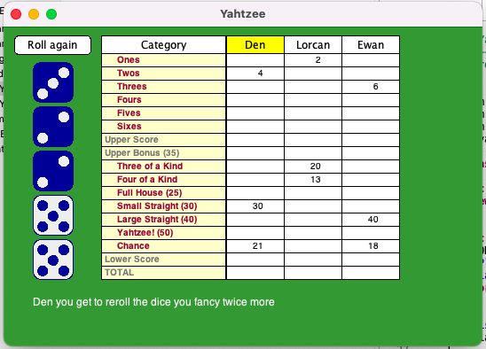

# Yahtzee

Implementation of the classic dice game [Yahtzee](https://en.wikipedia.org/wiki/Yahtzee)

This is Assignment #5 of CS106A Programming Methodologies module by Stanford University. Have fun playing!

## How to Play

Yahtzee is a game for 1 to 4 players

1. Each player takes turns rolling 5 dice with up to 3 rolls per turn to try to make configurations that match the 13 scoring categories

2. A player will roll the dice 3 times. If a player doesn’t want to change anything on a subsequent roll, they should reroll without selecting any dice
3. On their turn the player must select a category to score points with their dice configuration
4. If their meet the criteria for that category, they score points, otherwise they get 0 for that category
5. 13 rounds are played in total, and the player with the highest total score at the end of all rounds wins the game

## Rules and Game Logic

The scoreboard consists of 13 categories with the following dice configuration:

### Upper Board

*Image taken from the Yahtzee [wiki](https://en.wikipedia.org/wiki/Yahtzee)*

### Lower Board
*Image taken from the Yahtzee [wiki](https://en.wikipedia.org/wiki/Yahtzee)*

### Scoring

The scoreboard consists of:
- An upper score - totalling the scores for Ones - Sixes
- An upper bonus - a player is awarded a 35-point bonus if their upper section totals 63 or more
- A lower score - totalling the scores for Three of a Kind to Chance
- The total score - totalling the upper score, the upper bonus and the lower score to generate the final score

### Category Validation

- When a player selects a scoring category, whether the dice configuration meets the category requirements is validated e.g. for Three of a Kind, checking that the dice configuration has three of the same number
- A category can only be used once, which means that a player will sometimes have to choose a category that doesn’t match the configuration of the dice. In this case, the plays scores 0 in the selected category

- If a player attempts to reuse a category, they will also score 0 in the selected category

## Programming Techniques

Yahtzee uses **arrays** in a variety of contexts to implement a multiplayer dice game, including:

1. arrays for the dice initial roll and rerolls
2. arrays for the player names
3. arrays for the player’s score
4. a 2-dimensional array for the scorecard

**The YahtzeeDisplay class**

The drawing and event-handling in Yahtzee is handled by a precompiled class called YahtzeeDisplay. The Stanford documentation is available [here](https://cs.stanford.edu/people/eroberts/courses/cs106a/assignments/yahtzee/YahtzeeDisplay.html)
